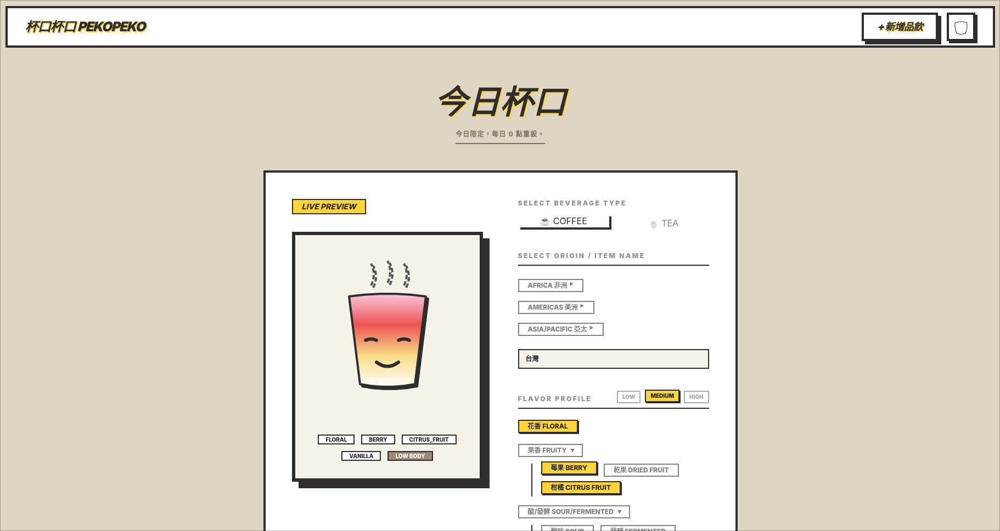
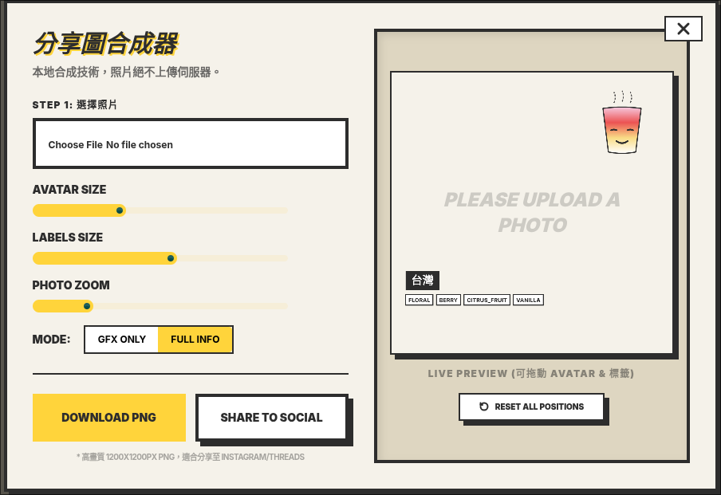

# 🍙 PekoPeko

PekoPeko 是一個基於 Astro 與 Svelte 5 構建的現代化社群分享平台，專為記錄與分享限時生活點滴而設計。使用者可以創建個性化的 Peko Avatar，並將其與照片及地圖標記合成，生成獨一無二的分享圖像。

## ✨ 核心功能

- **📍 限時生活貼文**: 發表具有時效性的內容，分享當下的心情與足跡。
- **🎨 Peko Avatar 產生器**: 高度自定義的 Avatar 系統，支持多種表情、配件與顏色組合，打造專屬角色。
- **📸 智慧照片合成**: 將您的專屬 Avatar、當前位置地圖與精美濾鏡照片合成為一張可供社群分享的高質感圖像。
- **🗺️ 地圖定位**: 整合 MapLibre GL，精準標記您的內容發布位置。

## 🖼️ 專案預覽


*圖 1: PekoPeko 主介面與限時貼文展示*


*圖 2: Avatar 編輯器與照片合成功能*

## 🛠️ 技術棧

本專案採用最前沿的技術進行開發，確保卓越的性能與極致的使用者體驗：

- **Frontend**: [Astro 6](https://astro.build/) & [Svelte 5 (Runes)](https://svelte.dev/)
- **Backend / Database**: [Supabase](https://supabase.com/) (Auth, Database, Storage)
- **Styling**: [Tailwind CSS 4](https://tailwindcss.com/) & [DaisyUI 5](https://daisyui.com/)
- **Mapping**: [MapLibre GL](https://maplibre.org/)
- **Deployment**: [Vercel](https://vercel.com/)
- **Language**: [TypeScript](https://www.typescriptlang.org/)

## 🚀 快速開始

### 1. 安裝依賴
```sh
npm install
```

### 2. 設定環境變數
請參考 `.env.example` 並在根目錄建立 `.env` 檔案，填入您的 Supabase 設定。

### 3. 啟動開發伺服器
```sh
npm run dev
```

伺服器將於 `http://localhost:4321` 啟動。

---

Built with ❤️ for the Peko community.
